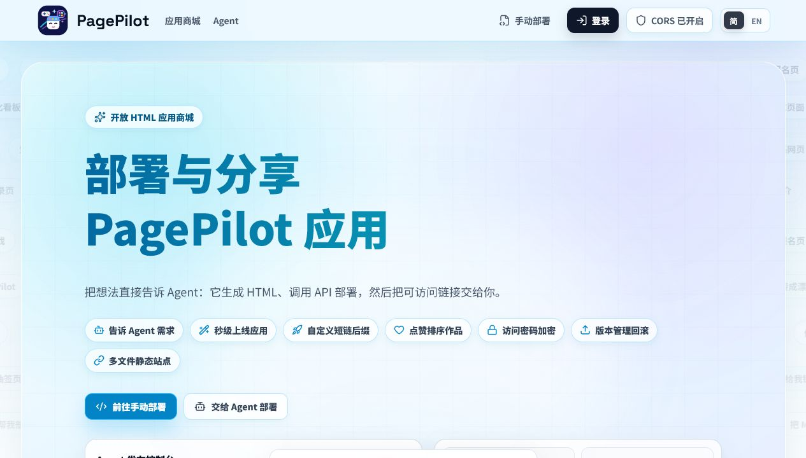
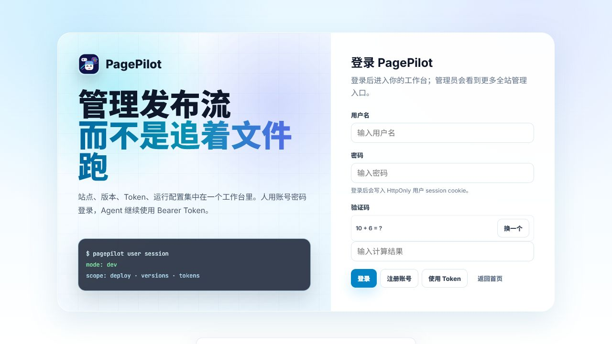

# PagePilot

PagePilot 是面向 AI Agent 的 HTML / Markdown / ZIP / 多文件静态站点发布平台。你把需求告诉 Agent，Agent 生成页面或应用，PagePilot 负责上线、访问密码、版本回滚、锁定下架、创作市场复用、API/CLI/MCP 接入和广告屏投放。

当前版本：`0.3.0`





## 当前状态与待办

当前代码已经完成 multipart 发布、ZIP 入口识别、Markdown 高级渲染链路、FTS 搜索、Bundle 元数据表写入、审计日志 API/OpenAPI、后台全局审计页和产品化筛选、站点详情最近审计摘要、站点详情基础接口、创作市场详情直达路由、可搜索 / 可复制的文件树、模板复用抽屉的源文件结构 / CLI / Agent / MCP 参数，以及前后台部署错误面板，并完成基础运行时 smoke、真实浏览器视觉 QA、旧库升级演练与一轮重点深度 QA。仍需继续产品化的重点包括：模板复用批量策略、生产数据量视觉复核以及真实 Docker 旧数据库升级验证。

详细状态和待办见 [docs/CURRENT_STATUS_AND_TODO.md](docs/CURRENT_STATUS_AND_TODO.md)。

## 包含内容

- 公共首页和创作市场位于 `/`，展示可搜索、可点赞、可访问密码保护的作品。
- 首页支持全屏弹幕动画。
- 手动部署页面位于 `/deploy`，创作市场位于 `/market`，屏幕介绍页位于 `/screens/`；API 文档收进后台 `/admin?tab=apiDocs`，机器可读契约位于 `/openapi.json`。
- 用户端页面由 `frontend/user` 的 React + Vite 工程构建，产物输出到 `internal/web/user/app`，并由 Go `embed` 打包进服务端二进制。
- 管理员控制台位于 `/admin`，由 `frontend/admin` 的 React + Vite 工程构建，包含登录、仪表盘、部署、站点、屏幕、令牌、用户、匿名、配置和版本控制。
- JSON API，并对外提供 `/openapi.json` 供 Agent 与外部集成使用。
- 版本化静态托管，访问路径为 `/agent/{code}`，并提供应用访问 URL `/agent/{code}/`。
- Go CLI（兼容旧 `hostctl` 命令，新文档统一称 `pagep`）、MCP 服务器以及一个独立可用的 PagePilot Agent Skill。
- 匿名部署配额、用户所有的 Agent Token，以及按用户的部署上限。
- 硬件屏幕绑定与投放：注册用户可以绑定多个广告屏，屏幕端 APP 通过 X5 WebView 播放 PagePilot 应用。
- 元数据存储使用 SQLite，静态资源托管在文件系统上。
- Skill 下载包默认内置在服务端二进制中，主下载地址为 `/skill/pagep.zip`；旧 `/skill/hostctl-deploy.zip` 保留兼容。后台不再编辑 Skill 源文件，只维护下载包。
- 提供 Docker、Caddy 和 systemd 的生产环境模板。

## 快速开始

```bash
go build -o bin/hostctl-server ./cmd/hostctl-server
HOSTCTL_DEV=1 ./bin/hostctl-server --addr 127.0.0.1:8787
```

打开以下地址：

- 用户应用：`http://127.0.0.1:8787/`
- 管理员控制台：`http://127.0.0.1:8787/admin`
- OpenAPI：`http://127.0.0.1:8787/openapi.json`

在开发模式下，数据会保存在 `./data` 下，部署冷却时间为 1 秒（除非另行覆盖），管理员 API 允许内置的开发会话访问。

Docker 快速启动：

```bash
docker compose up -d --build
```

主站不需要配置域名。首页、后台、`/agents/`、`/screens/`、二维码、Skill/MCP 文案和 `/agent/{code}/` 路径模式链接都会跟随当前打开 PagePilot 的域名。Skill、MCP 和 CLI 调用接口时，应把 `--server` / `PAGEPILOT_SERVER` 设置为希望返回给用户的 PagePilot 入口。完整 Docker 说明请见 [deploy/DOCKER.md](deploy/DOCKER.md)。
应用访问地址默认保持 `/agent/{code}/` 路径模式；如需启用 `https://{code}.example.com/` 泛域名模式，请参考 [deploy/APP_URL_MODE.md](deploy/APP_URL_MODE.md)。

后台“运行设置”只配置应用泛域名、上传限制、CORS、iframe 嵌入和匿名额度。只有启用应用泛域名模式时，才需要填写应用域名后缀；它不会改变主站入口。

发布接口返回的 `url`、`detailUrl` 和 `versionUrl` 是最终权威结果。路径模式下它们按当前访问入口或 `--server` 生成；泛域名模式下它们按后台配置的应用域名后缀、协议和端口生成。Skill、MCP、CLI 不应该自行拼最终应用 URL。

Docker 首次启动会在空数据库中自动创建默认管理员：

- 用户名：`admin`
- 密码：`123456`

首次登录后请进入后台的“账号设置”立即修改密码。

## 生产模式

生产环境必须开启认证：

```bash
/usr/local/bin/hostctl-server \
  --addr 127.0.0.1:8787 \
  --hosted-dir /var/www/hosted \
  --db /var/lib/hostctl/hostctl.db \
  --require-auth
```

对外可以使用 Caddy、Nginx、宝塔或云厂商负载均衡作为公开 TLS 反向代理。Docker 部署请参见 [deploy/DOCKER.md](deploy/DOCKER.md)；systemd + Caddy 部署、首个管理员、备份与监控说明请参见 [deploy/README.md](deploy/README.md)。

## API 概览

核心端点：

| 方法 | 路径 | 用途 |
|---|---|---|
| `GET` | `/api/health` | 健康检查 |
| `GET` | `/openapi.json` | 机器可读的 API 契约 |
| `GET` | `/api/session` | 创建 / 读取匿名部署会话 |
| `POST` | `/api/session/claim` | 将匿名会话发布内容认领到当前用户 |
| `POST` | `/api/deploy` | 部署新站点或追加版本 |
| `GET` | `/api/deploy/content?code=&version=&download=1` | 按源码权限读取元数据或下载 HTML / zip |
| `POST` | `/api/deploys/{code}/access` | 匿名或公开访客输入访问密码，获取 5 分钟、绑定版本的查看票据 |
| `POST` | `/api/security/csp-report` | 浏览器 CSP 违规报告入口，写入安全审计日志 |
| `PATCH` | `/api/deploys/{code}/access` | 站点 owner 或管理员设置 / 清除访问密码 |
| `PATCH` | `/api/admin/sites/{code}/reuse-policy` | 管理员设置源码下载和模板复用策略 |
| `PATCH` | `/api/admin/sites/{code}/security-mode` | 管理员设置站点运行安全模式 |
| `GET` | `/api/screens` | 列出当前注册用户绑定的硬件屏幕；管理员可看到待分配设备 |
| `POST` | `/api/screens/bind` | 使用短期配对码绑定硬件屏幕 |
| `POST` | `/api/admin/screens/{screenId}/assign` | 管理员将已连接但未配对的设备分配给用户 |
| `POST` | `/api/screens/{screenId}/publish` | 将自己的应用投放到自己的屏幕 |
| `POST` | `/api/screens/{screenId}/screenshot` | 下发屏幕截图指令 |
| `GET` | `/api/screens/{screenId}/screenshot` | 查看屏幕最近一次截图 |
| `POST` | `/api/screens/{screenId}/command` | 下发刷新、休眠、唤醒、软关机指令 |
| `DELETE` | `/api/screens/{screenId}` | 解绑自己的屏幕 |
| `POST` | `/api/device/pairing/start` | 屏幕 APP 创建短期配对码 |
| `POST` | `/api/device/pairing/complete` | 屏幕 APP 换取 Device Token |
| `GET` | `/api/device/ws` | 屏幕 APP 使用 Device Token 建立 WebSocket 控制通道 |
| `GET` | `/api/device/manifest` | 屏幕 APP 使用 Device Token 拉取播放清单 |
| `POST` | `/api/device/heartbeat` | 屏幕 APP 上报在线状态和设备信息 |
| `POST` | `/api/device/screenshot` | 屏幕 APP 按指令回传截图 |
| `POST` | `/api/device/command/ack` | 屏幕 APP 确认指令已完成 |
| `GET` | `/api/deploys` | 创作市场搜索 |
| `GET` | `/api/deploys/{publicId}` | 通过 UUID 或 code 获取公共部署详情 |
| `POST` | `/api/deploys/{code}/like` | 公开点赞 |
| `GET` | `/api/deploys/{code}/versions` | 列出所有版本 |
| `PATCH` | `/api/deploys/{code}/versions/{version}` | 覆盖未锁定的版本或修改状态 |
| `DELETE` | `/api/deploys/{code}/versions/{version}` | 删除未锁定的版本 |
| `PATCH` | `/api/deploys/{code}/current` | 回滚或切换当前版本 |
| `POST` | `/api/deploys/{code}/versions/{version}/lock` | 锁定 / 解锁某个版本 |
| `GET/PATCH` | `/api/deploys/{code}/primary-strategy` | 读取或设置 `likes` / `latest` 策略 |
| `PATCH` | `/api/admin/sites/{code}/pin` | 管理员置顶 / 取消置顶首页应用 |
| `GET` | `/api/admin/session` | 校验后台登录会话 |
| `GET` | `/api/admin/anonymous-sessions` | 查看匿名会话使用情况 |
| `GET` | `/api/admin/sites` | 管理员站点清单 |
| `DELETE` | `/api/admin/sites/{code}` | 删除整个站点 |
| `POST` | `/api/token` | 创建永久或临时令牌 |
| `GET` | `/api/tokens` | 列出令牌 |
| `DELETE` | `/api/tokens/{id}` | 吊销令牌 |
| `GET/PUT` | `/api/config` | 读取 / 更新运行时配置 |

生产环境认证规则：

- 匿名部署允许在配置的配额内进行，默认每个会话可部署 5 次。Agent 可以先调用 `/api/session` 并在写请求中携带 `X-Hostctl-Session`；如果未登录发布没有携带 session，服务端也会自动创建并记录匿名 session。
- 匿名身份分两类入口但底层统一：网页匿名使用浏览器 HttpOnly cookie；Agent 匿名使用本地 `~/.pagep/session.json` 中的 `sessionId`。两者在服务端都映射为 `anon:{sessionId}` owner，Agent 标识、IP 和 UA 只用于后台展示和排查。
- 匿名会话可以设置访问密码、删除和修改自己发布的站点；匿名统计只按实际未登录发布记录，未发布的空 session 不计入后台列表。
- 用户注册 / 登录或使用 Bearer Token 后，可以调用 `/api/session/claim` 认领当前匿名 session。认领后该 session 已发布的站点会迁移到 `user:{userId}`，一个用户可以认领多个匿名 session。
- Token 必须归属到用户。创建 Token 时默认永久有效，也可传 `expiresAt` 或 `ttlSeconds` 创建临时 Token。
- 管理员控制台、令牌管理、配置写入以及整站删除都需要管理员权限（`isAdmin=true`）。
- 后台“Skill & MCP”只维护固定下载包。默认内置包会保证 `/skill/pagep.zip` 不返回 404；旧的 `/skill/hostctl-deploy.zip` 保留兼容。管理员上传 ZIP 后会覆盖内置包。源码修改应在仓库或本地完成并重新打包，不能在后台直接编辑。
- 创作市场、点赞和静态页面访问保持公开；源码内容读取 / 下载按站点复用策略判断。
- 创作市场保留点赞排行；管理员置顶会优先于所有排序，置顶分组内部仍按当前选择的排序（如 `likes_desc`）排列。
- 账号注册、登录、登出和修改密码会分别以 `auth.register`、`auth.login`、`auth.logout`、`account.password` 写入审计日志，成功 / 失败都会记录操作者、目标用户和错误阶段等非敏感信息，不记录密码明文。
- 访问密码输入入口保持公开，匿名访客也可以输入密码查看加密站点；验证通过后浏览器获得 5 分钟签名访问票据。票据同时绑定站点密码哈希和版本号，站点改密码或切换当前版本后旧票据立即失效；显式历史版本 URL 会按该版本单独签发票据。访问密码验证成功 / 失败会以 `site.access_login` 写入安全审计日志，记录站点、版本、结果和失败原因，不记录密码明文。
- 访问密码只授权浏览页面，不等于源码下载或模板复用权限。源码下载和模板复用需要登录用户或已绑定注册用户的 Token；公开且未加密的作品在登录后默认可下载源码和复用，加密、不公开、下架或策略受限作品对普通用户默认禁止下载源码和复用。站点所有者和管理员拥有管理权限，可直接下载加密作品源码用于审计、备份或二次修改。详情接口会返回 `reuse.allowDownload`、`reuse.allowReuse`、`reuse.policyNote`、CLI 命令、Agent 提示词和 MCP 参数。
- 屏幕投放只允许注册用户 Token 或登录用户会话调用；匿名 session 不能绑定屏幕或投屏。APP 已连接但未配对时只会出现在管理员后台的“待分配设备”，不会出现在普通用户屏幕列表里。
- 屏幕 APP 不持有用户 Token，只持有可吊销的 Device Token；Device Token 只能拉取自己的 manifest、建立自己的 WebSocket 控制通道、上报心跳和按指令回传截图。
- 屏幕配对码是 5 分钟一次性短码，只用于首次绑定，不是长期权限。
- 内置页面 `/deploy`、`/market`、`/agents/`、`/screens/` 由 Go 服务内嵌返回；后台 API 文档位于 `/admin?tab=apiDocs`。反向代理应把这些路径原样转发给 PagePilot。
- 后台 `/admin` 和 `/admin/assets/*` 使用独立严格 CSP：只允许同源脚本、样式、接口和资源，不允许 `unsafe-inline` / `unsafe-eval`，并通过 `frame-ancestors 'none'` 禁止被 iframe 嵌入。
- 首页、创作市场详情、手动部署和后台渲染视图里的预览 iframe 使用统一 `PREVIEW_IFRAME_SANDBOX`：允许脚本、表单、下载、弹窗和用户触发的顶层导航，但不包含 `allow-same-origin`。真实 `/agent/{code}` 应用运行时仍按站点安全模式设置 CSP / sandbox。
- 如果前面有 Nginx、宝塔或负载均衡，必须为 `/api/device/ws` 转发 WebSocket Upgrade 头，否则后台刷新、截图、休眠等指令会退化为不可实时或连接失败。
- CORS 白名单只控制外部网页用 `fetch` / XHR 调用 PagePilot API，不控制 iframe。应用是否允许被外部网站嵌入由后台“运行设置 -> 跨域与嵌入 -> iframe 嵌入”控制，支持任意、仅本站、白名单和禁止嵌入，底层会写入托管应用响应的 CSP `frame-ancestors`。
- 托管 HTML 和 Markdown 响应会携带 `report-uri /api/security/csp-report`。浏览器通过传统 `application/csp-report` 或 Reporting API 上报的 CSP 违规都会以 `security.csp_report` 写入审计日志，管理员可在后台“审计日志”按动作、站点、IP、UA 或关键字排查被拦截的脚本、资源和嵌入问题；也可以在后台站点详情中查看按当前 code 过滤的最近审计摘要。Markdown 脚本策略使用 nonce-only `script-src`，不依赖 `script-src 'self'`，也不允许 `unsafe-inline` / `unsafe-eval`；KaTeX、auto-render、Mermaid 和平台初始化脚本都由 nonce 放行，公式和图表运行时只在样式侧做必要放行。

## 手动部署与多文件站点

手动部署页面和后台“发布应用”都支持两种模式：

- 单文件：粘贴或上传一个 HTML / Markdown 文件；如果上传 ZIP，会自动切到多文件模式并交给服务端识别真实入口。
- 多文件项目：上传多个文件、目录或单个 ZIP 包，PagePilot 按相对路径保存 `HTML/CSS/JS/图片/字体/JSON` 等资源，并自动选择 `index.html`、`README.md` 或第一个 HTML / Markdown 文件作为入口；只有多入口或特殊入口路径时才需要显式填写入口提示。

`POST /api/deploy` 同时支持 `application/json` 和 `multipart/form-data`；`PATCH /api/deploys/{code}/versions/{version}` 覆盖版本也支持 `multipart/form-data`。CLI 和 Skill 发布、追加或覆盖本地文件、目录、ZIP 时优先走 multipart；MCP 发布/追加同样走 multipart：目录会临时打成 ZIP，ZIP 文件作为单个文件上传，服务端负责识别真实站点根目录、入口文件和文件树。`filename` 只是可选入口提示，普通上传不需要传；只有服务端提示多入口、入口缺失或用户明确入口路径时才填写。旧 JSON/base64 请求仍保留兼容，但不再作为大包、多文件项目的首选链路。复用创作市场作品时，发布请求可以传 `templateSourceCode` / `templateSourceVersion`，CLI 对应 `--template-source-code` / `--template-source-version`，服务端会在新站点和新版本上记录来源，并增加来源作品的复用次数。前台作品复用面板会区分“新建二创”和“更新已有发布”：新建会生成新 code，更新模式要求先填写自己拥有的目标 code，并按追加版本处理。

ZIP 入口识别规则会剥离单一外层目录，优先选择 `index.html`、`index.htm`、`README.md` 或 `README.markdown`；如果包里存在多个彼此独立的网站根，服务端会拒绝并返回友好错误，避免误把批量文件包发布成一个坏站点。ZIP 中的绝对路径、盘符、`..`、空路径段和路径穿越都会被拒绝。ZIP/Bundle 失败会返回 `stage=zip_bundle`，常见错误包括 `ZIP_UNSAFE_PATH`、`ZIP_AMBIGUOUS_ENTRY`、`ZIP_ENTRY_MISSING`、`ZIP_FILE_TOO_LARGE`、`ZIP_TOTAL_TOO_LARGE` 和 `ZIP_TOO_MANY_FILES`；前台手动部署页和后台发布页会展示错误阶段、稳定错误码、服务端 `hint`、本地排查建议和可复制诊断信息，避免用户猜目录结构。

发布或覆盖版本时会写入 `version_bundles` 元数据。`kind` 使用稳定机器值：`single_html`、`markdown`、`zip_site`、`static_site`；详情 API 同时返回中文 `kindLabel`、入口文件、ZIP 根目录、文件树、入口识别说明和安全模式，旧数据缺少元数据时会按入口和文件数兜底推断。前台支持 `/market/{code-or-publicId}` 直达创作市场详情，刷新或分享链接后仍会重新拉取文件树与复用参数；前台和后台文件树都支持路径 / 文件名 / SHA 搜索、目录统计、复制路径和复制 SHA。

多文件站点应使用相对链接，例如 `./assets/app.css`、`settings.html`。默认兼容入口是 `/agent/{code}/`，所以不要在路径模式下把资源写成 `/assets/app.css` 这种根路径，除非已经启用泛域名模式。

更新已有发布时必须填写已有 `code` 并选择“追加为新版本”。`code` 可以从返回链接 `/agent/{code}/`、应用详情页、后台站点列表、Skill `list_sites` 或 MCP `list_sites` 获取。追加版本不会创建新访问地址，也不会改变原站点的公开方式和访问密码。

Markdown 会作为一等入口托管，支持相对图片、表格、任务列表、删除线、自动链接、代码块高亮、行内 `$...$`、单行块级 `$$E=mc^2$$`、多行块级 `$$ ... $$` 和 Mermaid 图表。服务端负责 Markdown 解析、安全清洗、Chroma 高亮 HTML、渲染缓存和严格脚本 CSP；页面自动加载 PagePilot 内置同源 KaTeX / Mermaid runtime 和 KaTeX 字体，外部 runtime 脚本与平台初始化脚本都由 nonce 放行，Markdown CSP 不使用 `script-src 'self'` 扩大脚本面。KaTeX / Mermaid 需要的运行时样式通过受控的 `style-src-elem` / `style-src-attr` 放行，不扩大脚本执行面。不需要 Agent 把 KaTeX、Mermaid 或 highlight.js 随 Markdown 一起打包。Markdown 页面支持 `?theme=auto|light|dark`，渲染缓存 key 包含 `code`、版本、入口、内容 SHA256、主题和 renderer version，避免不同主题或运行时版本复用旧 HTML。

市场搜索已接入 SQLite FTS5，并保留中文 `LIKE` 回退；老数据库启动时会自动回填索引。新增的渲染缓存、Bundle 元数据和审计日志表都是增量迁移，设计上不会清空已有站点、版本或用户数据。`node scripts/legacy-upgrade-qa.mjs` 会构造旧 SQLite + hosted 目录并用当前服务启动验证迁移；发布前仍需要在服务器用真实旧数据库和 hosted 目录跑完整 Docker 升级验证。

结构化错误格式如下：

```json
{
  "success": false,
  "errorCode": "VERSION_LOCKED",
  "stage": "overwrite",
  "detail": "Version 2 is locked and cannot be modified.",
  "hint": "Append a new version instead of overwriting.",
  "retryAfterSeconds": null,
  "requestId": "req-..."
}
```

## CLI

```bash
go build -o bin/pagep ./cmd/hostctl

bin/pagep config set server https://host.example.com
bin/pagep config set token <pagepilot-token>

bin/pagep deploy ./site --code my-landing --description "Landing page for Project X."
bin/pagep append my-landing ./site-v2 --description "Second version with updated copy."
bin/pagep versions my-landing
bin/pagep current my-landing 1
bin/pagep lock my-landing 2
bin/pagep token create ci-bot --save
bin/pagep token create temp-runner --ttl 24h --save
bin/pagep token create admin --admin
bin/pagep claim-session <anonymous-session-id>
bin/pagep admin pin-site my-landing
bin/pagep admin pin-site my-landing --unpin
```

旧 `hostctl` 二进制名保留为兼容别名；新文档、Docker 镜像和 Agent 文案统一使用 `pagep`。

## Agent 技能

内置 Skill 的对外名称为 `pagep`。它的 Python 包装器仅依赖标准库，可以脱离 Go CLI 单独运行；安装到 Agent 后可把 `scripts/pagep.py` 包装成 `pagep` 命令。后台和用户端主下载地址为 `/skill/pagep.zip`；服务端优先返回后台上传的 ZIP，没有上传包时返回内置默认包。

```bash
python scripts/pagep.py doctor --server http://127.0.0.1:8787
python scripts/pagep.py config set server http://127.0.0.1:8787
python scripts/pagep.py deploy ./site --code demo --title "演示站点" --description "Shareable demo site."
python scripts/pagep.py deploy ./site --code demo --update --title "演示站点升级版" --description "Revised demo site."
python scripts/pagep.py token create ci-bot --save
python scripts/pagep.py token create temp-runner --ttl-seconds 86400 --save
python scripts/pagep.py claim-session
python scripts/pagep.py admin sites
python scripts/pagep.py admin pin-site my-landing
```

`--server`、`PAGEPILOT_SERVER` 或 `pagep config set server <url>` 表示本次 Agent 调用 PagePilot API 的入口地址，不是全局主站配置。Python Skill 版 `pagep` 的读取优先级是：命令行 `--server`、环境变量、`~/.pagep/config.json`、本地默认 `http://localhost:8787`；Token 读取优先级是：命令行 `--token`、环境变量、已保存配置。`pagep token create <label> --save` 会把服务端仅返回一次的明文 Token 保存到本地配置，后续命令不需要重复传 Token。路径模式发布成功后，接口返回的应用链接会使用这个入口；如果要把公网链接交给用户，就用公网地址作为 `--server` 或保存为默认 server。泛域名模式的应用链接由后台“运行设置 -> 应用链接规则”决定，和 `--server` 只用于调用控制面入口的职责分开。旧环境变量仍会被兼容读取，但新文档统一使用 `PAGEPILOT_*`。

发布或追加版本成功后，`pagep` Skill 会先输出中文摘要，包含服务端返回的 `访问 URL`、`详情 URL` 和 `版本 URL`，随后继续输出 JSON 供自动化解析。Agent 应直接转交这些服务端返回链接，不要按本机 host、端口或域名规则自行拼接。

屏幕投放命令仅支持注册用户 Token：

```bash
python scripts/pagep.py screen list --server https://host.example.com
python scripts/pagep.py screen bind 123456 --name "大厅屏"
python scripts/pagep.py screen assign screen_xxx --owner-user-id user_xxx --name "大厅屏"  # 管理员
python scripts/pagep.py screen publish --screen screen_xxx --app my-landing
python scripts/pagep.py screen publish --screen screen_xxx --source ./site --title "大屏展示" --description "Fullscreen display for the lobby."
python scripts/pagep.py screen screenshot screen_xxx --output ./screen-shot.jpg
python scripts/pagep.py screen refresh screen_xxx
python scripts/pagep.py screen sleep screen_xxx
python scripts/pagep.py screen wake screen_xxx
python scripts/pagep.py screen shutdown screen_xxx
```

管理员也可以通过 CLI 调整源码下载和模板复用策略：

```bash
python scripts/pagep.py admin site-detail my-app
python scripts/pagep.py admin audit-logs --site-code my-app --action site.visibility --page-size 20
python scripts/pagep.py admin reuse-policy my-app --source-download deny --reuse deny
python scripts/pagep.py admin reuse-policy my-app --source-download allow --reuse allow
python scripts/pagep.py admin security-mode my-app --mode strict
```

本项目还在 `cmd/hostctl-mcp` 提供了 MCP 服务器，构建后的对外命令名为 `pagep-mcp`，供偏好通过 stdio 走 JSON-RPC 的工具使用。MCP 支持部署、访问密码、匿名认领、管理员置顶、站点详情 / 文件树、审计日志查询、源码下载 / 模板复用策略、站点安全模式，以及 `list_screens`、`bind_screen`、`publish_screen`、`request_screen_screenshot`、`send_screen_command`、`unbind_screen` 等屏幕工具。CLI 的 `pagep admin audit-logs` 会在摘要表后输出每条日志的 `User-Agent` 和 `Detail` JSON，便于直接排查访问密码、CSP、屏幕和版本管理问题。旧 `hostctl-mcp` 可作为兼容别名保留。

MCP 使用 `PAGEPILOT_SERVER` 作为控制面入口，并把它发送给后端用于路径模式 URL 生成。反向代理部署时，如果 MCP 使用内网地址连接 PagePilot，路径模式返回值也会偏向内网地址；生产环境建议让 MCP 使用用户可访问的公网入口。

对已有项目，Agent 应在原 code 上追加版本，而不是创建新的访问地址。技能会把 `source -> code` 记在 `~/.pagep/projects.json`；如果没有记录的 code，Agent 在部署更新前应向用户索要原始 code 或 URL。

## 硬件屏幕 APP

屏幕端代码位于 [apps/screen-app](apps/screen-app)。当前路线是 Android Kotlin 壳 + X5 WebView：

- 首次启动由现场人员输入 PagePilot 服务器地址，地址保存在设备本地。
- 屏幕 APP 创建配对码，用户在后台“屏幕”页或 Skill 中输入配对码绑定。
- 一个注册用户可以绑定多个屏幕。
- 投屏发布的是 manifest 播放清单，不是直接下发裸 HTML 字符串。
- 屏幕 APP 通过 `/api/device/ws` 保持 WebSocket 长连接，投屏、刷新、截图、休眠、唤醒和软关机指令会实时下发；`/api/device/manifest` 保留为初始化和兜底读取。
- 屏幕端右上角连续点击 5 次打开隐藏设置，可查看绑定用户、设备信息、分辨率、横竖屏、WebSocket 状态和 X5/WebView 运行状态，也可切换服务器或清除绑定。
- 后台、Skill 和 MCP 可下发截图、刷新、休眠、唤醒和软关机指令；截图只在后台指令触发时回传，后台点击截图会弹出等待窗口并在新图片返回后立即显示。
- 软关机、开机自启和定时开关机依赖硬件或系统权限，通用 APP 侧只能做黑屏待机和刷新播放。

## 存储布局

```text
/var/www/hosted/
  {code}/
    current -> versions/3
    versions/
      1/
      2/
      3/
        index.html
        styles.css
        assets/logo.png
```

SQLite 中保存令牌、站点、版本、文件、点赞与可变设置。静态字节直接落在磁盘上，让对外服务保持简单，也方便备份。

## 存储、邮箱验证与 OSS

当前上传文件默认存储在本地文件系统：

- Docker 部署：`./data/docker/hosted` 挂载到容器内 `/var/www/hosted`。
- 本地开发：`HOSTCTL_DEV=1` 时使用 `./data/hosted`。
- 元数据、账号、Token、分类、版本和运行设置写入 SQLite，Docker 默认挂载到 `./data/docker/hostctl/hostctl.db`。

注册与存储能力通过环境变量控制，后台“运行设置”会展示当前状态：

- `HOSTCTL_ALLOW_REGISTRATION=true|false`：是否允许公开注册。关闭后登录页隐藏注册入口，`POST /api/auth/register` 会返回 403；管理员仍可在后台维护用户。
- `HOSTCTL_EMAIL_VERIFICATION_ENABLED=false`：注册邮箱验证开关。开启后注册页会要求邮箱、图片验证码和 6 位邮箱验证码；服务端通过 SMTP 发送验证码，注册成功后记录 `email_verified=true`。如果开启但 SMTP 未配置，注册页会提示联系管理员。
- `HOSTCTL_STORAGE_BACKEND=local|oss`：文件存储后端。`local` 使用本机 `/var/www/hosted`；`oss` 使用阿里云 OSS，发布写入、预览读取、源码下载、覆盖版本、删除版本和删除站点都会走对象存储。
- 阿里云 OSS 相关：`HOSTCTL_OSS_ENDPOINT`、`HOSTCTL_OSS_BUCKET`、`HOSTCTL_OSS_ACCESS_KEY_ID`、`HOSTCTL_OSS_ACCESS_KEY_SECRET`、`HOSTCTL_OSS_PREFIX`、`HOSTCTL_OSS_PUBLIC_BASE_URL`。`HOSTCTL_OSS_PREFIX` 建议按环境区分，例如 `prod/pagepilot`。

## 限制与安全

- 单文件默认上限：1 MiB。
- 整站默认上限：10 MiB。
- 单站点文件数默认上限：100。
- 描述（description）为必填项，长度上限 240 字符。
- 路径会拒绝绝对路径以及 `..`。
- 版本锁定后无法覆盖或删除。
- 令牌明文只返回一次；服务器只保存哈希，并按 `expires_at` 自动拒绝过期 Token。
- 已上线环境必须保留原 `HOSTCTL_MASTER_KEY`；旧版本从未配置时使用历史兼容值 `pagepilot-dev-master-key-0000000`。全新空库 Docker 部署建议复制 `.env.example` 为 `.env`，并填入 `openssl rand -base64 32` 生成的独立值；升级时不要更换主密钥。
- 访问密码票据只保存于 HttpOnly Cookie 中，有效期为 5 分钟，且与当前站点密码哈希和目标版本绑定。访问密码只授权浏览页面，不授予源码下载或模板复用权限；加密站点源码下载仅站点所有者和管理员可直接执行，普通用户即使知道访问密码也不能下载源码。托管页自身的 CSP 也会限制页面脚本直接调用管理 API，源码下载权限以服务端策略为准。
- 生产服务模板使用受限的 systemd 沙箱。

## 测试

```bash
python scripts/build_skill_zip.py
go test -count=1 ./cmd/... ./internal/...
npm run build --prefix frontend/user
npm run build --prefix frontend/admin
node scripts/runtime-qa.mjs
node scripts/visual-qa.mjs
node scripts/legacy-upgrade-qa.mjs
node scripts/docker-upgrade-qa.mjs
python -m py_compile skill/hostctl-deploy/scripts/hostctl_deploy.py skill/hostctl-deploy/scripts/pagep.py
python skill/hostctl-deploy/scripts/hostctl_deploy_test.py
```

`node scripts/runtime-qa.mjs` 会自动编译并启动一个临时 PagePilot 服务，使用临时 SQLite 和 hosted 目录，不会写入当前 `data/`。它覆盖注册成功 / 失败、管理员登录、账号改密、登出、Token 创建和吊销、匿名发布显式认领与归属迁移、已认领匿名 session 拒绝继续发布、Markdown 发布和渲染、真实 ZIP 站点发布、ZIP Bundle 详情、ZIP 相对资源访问、ZIP 多入口 / 缺少入口 / 路径穿越的稳定错误码、市场详情、后台站点详情、登录用户公开未加密站点源码下载及 `source_download` 成功审计、匿名源码下载登录提示、加密站点对发布者 Token / 管理员 Cookie / 匿名访问密码 Cookie 的源码下载禁用及 `source_download` 失败审计、加密访问、访问密码票据绑定版本和切换当前版本后的失效、模板复用来源记录、屏幕绑定 / 投放 / 截图 / 指令 / 解绑、认证 / 账号 / 匿名认领 / 访问密码 / 站点管理 / 版本锁定 / 下架 / 切换当前 / 覆盖 / 删除 / Token 管理 / 运行设置 / 市场分类 / Skill 包上传 / 用户管理 / 屏幕操作审计日志、审计分页与用户 / 站点 / 动作 / 角色 / 时间 / 详情关键字过滤、传统 CSP report 与 Reporting API 审计、CORS 边界、OpenAPI 和 Skill ZIP 下载。

`node scripts/visual-qa.mjs` 会启动临时服务并用真实浏览器检查首页、创作市场、市场详情、手动部署、Skill/MCP、屏幕介绍、HTML/Markdown 运行页、加密访问页、后台主要 tab、审计日志筛选和翻页的桌面与移动端横向溢出、空白页和浏览器错误。它会额外发布一个多文件站点、一个加密站点和超过一页的市场批量样本，检查创作市场加载更多、市场详情 Bundle 信息、折叠文件树、模板复用弹窗、后台站点详情完整文件树和复用参数，以及加密作品的源码下载 / 模板复用受限提示。该脚本需要本机可用的 Playwright；如果项目未安装，可先运行 `npm install --no-save playwright` 和 `npx playwright install chromium`，脚本也会尝试回退到系统 Edge/Chrome。

`node scripts/legacy-upgrade-qa.mjs` 会构造一份旧 SQLite 数据库和旧 hosted 目录，包含公开站点、加密站点、旧管理员、Token、匿名 session、屏幕绑定、审计日志和托管文件；随后启动当前服务触发迁移，并通过后台 API、创作市场搜索、`/agent/{code}/`、访问密码和源码下载权限检查确认升级后仍可用。它不依赖 Docker，不能替代服务器上的真实 `docker compose up -d --build` 升级演练。

`node scripts/docker-upgrade-qa.mjs` 会在临时目录构造旧 SQLite + hosted 数据，生成临时 compose override，执行真实 `docker compose up -d --build`，再通过容器 HTTP 接口和直接 SQLite 校验检查站点、版本、Token、匿名 session、屏幕、访问密码、FTS、Bundle、审计表和 Skill ZIP。该脚本需要服务器已安装 Docker Compose 和 Go；可加 `--keep` 保留临时目录便于排查。

`python scripts/build_skill_zip.py` 会把 `skill/hostctl-deploy` 重新打包为内置下载包，ZIP 内固定使用 `pagep/` 前缀，并校验 `pagep/SKILL.md` 存在、`__pycache__`、`.pyc`、`.pyo` 和测试脚本不会被打进去。`make build`、`make build-linux` 和 `make docker` 会自动先执行该步骤；直接运行 `docker compose up -d --build` 时，Dockerfile 的 Go builder 阶段也会在编译前执行同一脚本，避免二进制 embed 到旧 Skill ZIP。

旧 `test_e2e.sh` 仍需要在 `http://127.0.0.1:8787` 上有本地开发服务器。

## 项目结构

```text
cmd/
  hostctl/          CLI
  hostctl-server/   HTTP 服务器
  hostctl-mcp/      MCP 服务器源码（对外命令 pagep-mcp）
internal/
  api/              HTTP 路由、类型、错误、OpenAPI
  auth/             bearer token 服务
  client/           Go API 客户端
  config/           运行时配置
  deploy/           部署 / 版本逻辑
  store/            SQLite 存储
  web/              内嵌的用户与管理界面
  web/skill/        内置 Skill ZIP 下载包
deploy/             Caddy / systemd 生产模板
  DOCKER.md         Docker 部署、升级、备份与排障
skill/              pagep agent 技能源码和内置资源
```
