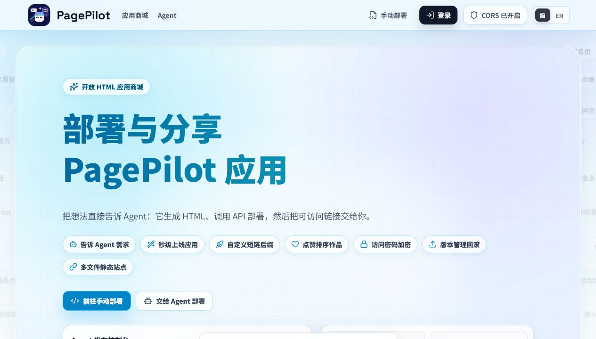

# PagePilot

PagePilot 是面向 AI Agent 的静态站点发布与运营平台。Agent 可以把 HTML、Markdown、ZIP 或多文件项目交给 PagePilot，平台负责发布、版本、访问控制、创作市场、源码复用、API/CLI/MCP 接入，以及硬件屏幕投放。

当前版本：`0.3.1`

## 从哪里开始

| 目标 | 文档 |
| --- | --- |
| 本地运行、第一次发布 | [入门指南](docs/GETTING_STARTED.md) |
| 配置环境变量、存储、邮箱和安全策略 | [配置参考](docs/CONFIGURATION.md) |
| 接入 HTTP API、CLI、Skill 或 MCP | [API 与集成](docs/API_INTEGRATION.md) |
| Docker、systemd、备份、升级和排障 | [运维手册](docs/OPERATIONS.md) |
| 配置应用链接和泛域名 | [应用链接模式](deploy/APP_URL_MODE.md) |
| Docker Compose | [Docker 部署](deploy/DOCKER.md) |
| systemd + Caddy | [生产环境部署](deploy/README.md) |
| 全部项目文档 | [文档索引](docs/README.md) |

## 能力地图

- 用户端 `/`：首页、弹幕和作品入口。
- 手动部署 `/deploy`：发布单文件、Markdown、ZIP、目录或多文件项目。
- 创作市场 `/market`：搜索、分类、点赞、收藏、详情、文件树和模板复用。
- Agent 指南 `/agents/`：查看 CLI、Skill、MCP 的接入入口。
- 屏幕指南 `/screens/`：了解 Android 屏幕配对、播放、截图和控制。
- 管理后台 `/admin`：登录、仪表盘、站点、版本、屏幕、Token、用户、匿名会话、配置、审计日志和 API 文档。
- 机器接口 `/openapi.json`：当前服务生成的 OpenAPI 契约。
- 内置 Skill `/skill/pagep.zip`：可下载的 `pagep` Agent Skill；旧 `/skill/hostctl-deploy.zip` 保留兼容。

## 工作方式

~~~text
浏览器 / Agent / CLI / MCP
          |
          v
      PagePilot API
       |        |
       v        v
    SQLite    文件存储
       |
       +--> URL 生成（路径 / 泛域名 / 双模式）
       +--> 版本、访问控制、市场、审计
       +--> 屏幕 WebSocket 控制通道
~~~

每个发布包含一个稳定 `code` 和一个或多个版本。`current` 指向当前对外展示的版本；追加版本不会产生新的站点地址。版本可以锁定、下线、切换或删除，站点所有者和管理员的操作边界由服务端统一校验。

## 五分钟本地启动

要求：Go 1.22+；如果要重新构建前端，需要 Node.js 22+ 和 npm；如果要使用 Skill，需要 Python 3.10+。

开发环境请显式设置 `HOSTCTL_DEV=1`，它会把数据库和文件放到仓库的 `data/`，并把默认冷却时间改为 1 秒：

~~~bash
HOSTCTL_DEV=1 go run ./cmd/hostctl-server --addr 127.0.0.1:8787
~~~

打开：

- 用户端：<http://127.0.0.1:8787/>
- 手动部署：<http://127.0.0.1:8787/deploy>
- 创作市场：<http://127.0.0.1:8787/market>
- 管理后台：<http://127.0.0.1:8787/admin>
- OpenAPI：<http://127.0.0.1:8787/openapi.json>

本地构建全部内嵌产物：

~~~bash
make build
make run
~~~

首次生产启动必须设置 `HOSTCTL_MASTER_KEY`（必须解码为 32 字节）。空数据库还需要 `HOSTCTL_ADMIN_USERNAME` 和 `HOSTCTL_ADMIN_PASSWORD` 创建首个管理员；不要把这些值提交到 Git。Docker 方式请从 [`.env.example`](.env.example) 复制配置，详见 [Docker 部署](deploy/DOCKER.md)。

## 应用链接模式

PagePilot 返回的 `url`、`pathUrl`、`domainUrl`、`detailUrl`、`versionUrl` 是最终结果，调用方不要自行拼接链接。

| 模式 | 当前应用 | 历史版本 | 适用情况 |
| --- | --- | --- | --- |
| `path` | `https://pagepilot.example.com/agent/demo/` | `https://pagepilot.example.com/agent/demo/versions/2/` | 不需要额外域名，默认模式 |
| `domain` | `https://demo.pg.example.com/` | `https://demo.pg.example.com/versions/2/` | 用户 HTML/JS 需要独立源隔离 |
| `dual` | 同时返回以上两种地址 | 同时返回以上两种地址 | 迁移期间兼容旧链接 |

开启 `domain` 或 `dual` 前必须同时完成 DNS、TLS 和反向代理：

1. DNS 添加 `*.pg.example.com` 的 A/AAAA 或 CNAME，指向与主站相同的反向代理；不需要为每个 `code` 单独加记录。
2. TLS 证书同时覆盖主站和 `*.pg.example.com`。泛域名证书只覆盖一层子域名，通常需要 DNS-01 验证。
3. Nginx/Caddy 的同一个站点接收主站和泛域名，并把全部路径转发到 PagePilot；Nginx 还要转发 `/api/device/ws` 的 WebSocket Upgrade。
4. 环境变量 `HOSTCTL_APP_DOMAIN_SUFFIX`（后台字段 `appDomainSuffix`）只填 `pg.example.com`，不要填 `*.pg.example.com`；`appURLScheme` 必须与外部入口一致。外部使用 `https://host:1143` 时，使用 `appURLPort=1143`。

详细配置、非标准端口、验证命令、切换和回滚见 [deploy/APP_URL_MODE.md](deploy/APP_URL_MODE.md)。协议配置不一致会让 HTTPS 市场页面加载 HTTP 应用 iframe，浏览器会按 Mixed Content 拦截。

## 发布流程

### 网页

在 `/deploy` 选择单文件或多文件模式，上传 HTML、Markdown、ZIP 或目录，填写标题和描述后发布。ZIP 会自动识别 `index.html`、`README.md` 或其它入口；存在多个独立网站根目录时，服务端会拒绝并给出修复提示。

### Go CLI

构建后命令名为 `pagep`，旧 `hostctl` 保留兼容：

~~~bash
go build -o bin/pagep ./cmd/hostctl
bin/pagep config set server https://pagepilot.example.com
bin/pagep token create ci-bot --save
bin/pagep preflight ./site
bin/pagep deploy ./site --code demo --description "演示站点"
bin/pagep append demo ./site-v2 --description "第二个版本"
bin/pagep versions demo
bin/pagep current demo 2
bin/pagep lock demo 2
bin/pagep get demo --version 2 --download --output ./backup
~~~

常用命令还包括 `doctor`、`overwrite`、`unlock`、`status`、`delete-version`、`market`、`like`、`strategy`、`access`、`claim-session`、`admin` 和 `config`。完整参数以 `pagep --help` 和 [API 与集成](docs/API_INTEGRATION.md) 为准。

### Agent Skill

Skill 的对外名称是 `pagep`，下载后可直接运行：

~~~bash
python scripts/pagep.py doctor --server https://pagepilot.example.com
python scripts/pagep.py preflight ./site
python scripts/pagep.py deploy ./site --title "演示站点" --description "可分享的演示页面"
~~~

Skill 只有在用户明确要求发布、生成访问链接、投放屏幕或执行 PagePilot 管理操作时才上传。它会把匿名身份保存在 `~/.pagep/session.json`，Token 保存在 `~/.pagep/config.json`；发布成功后应原样转交服务端返回的访问、详情和版本链接。规则和屏幕命令见 [`skill/hostctl-deploy/SKILL.md`](skill/hostctl-deploy/SKILL.md)。

### MCP

构建后的 MCP 命令名为 `pagep-mcp`，通过 stdio 提供部署、版本、市场、访问控制、审计和屏幕工具。MCP 使用 `PAGEPILOT_SERVER` 连接控制面，应用 URL 仍以 API 响应为准。工具清单和输入约束见 [API 与集成](docs/API_INTEGRATION.md)。

## 站点、版本和配额

- 新建站点占用一个应用额度；追加版本、隐藏、下线和锁定不会额外占用。
- 删除整个站点后立即释放一个额度；删除单个版本不会恢复站点额度。
- 匿名会话默认最多保有 5 个应用；注册用户额度由服务端运行设置决定，`-1` 表示不限制。
- 未登录网页使用 HttpOnly 会话 Cookie；CLI、Skill、MCP 和外部 API 使用 Bearer Token。
- 匿名发布可通过 `/api/session/claim` 或 `pagep claim-session <session-id>` 认领到注册用户；已认领会话不能继续作为匿名身份发布。
- `public` 作品进入创作市场，`unlisted` 只能通过链接访问；匿名发布只能使用 `unlisted`。
- 访问密码票据有效 5 分钟并绑定版本，只授权浏览，不等于源码下载或模板复用。

## 多文件和 Markdown

单文件适合简单页面；目录或 ZIP 适合多页面、图片、字体和离线资源。多文件页面必须使用相对链接，例如 `./assets/app.css`、`settings.html`；路径模式下不要使用 `/assets/app.css` 这样的根路径。

服务端会记录 Bundle 元数据：`single_html`、`markdown`、`zip_site`、`static_site`。Markdown 支持 GFM 表格、任务列表、代码高亮、相对图片、KaTeX 公式和 Mermaid；服务端负责解析、清洗、缓存和 CSP nonce。ZIP 路径穿越、绝对路径、符号链接、重复路径、入口歧义和大小超限会在上传前后返回稳定错误码。

## 屏幕投放

屏幕端位于 [`apps/screen-app`](apps/screen-app)，是 Android Kotlin 壳 + X5 WebView。设备先创建 5 分钟一次性配对码，注册用户在后台或 Skill 输入配对码绑定，然后发布应用到 manifest 播放清单。控制通道使用 `/api/device/ws`，支持刷新、截图、休眠、唤醒和软关机；屏幕端只持有可吊销的 Device Token，不持有用户 Token。构建和现场操作见 [`apps/screen-app/README.md`](apps/screen-app/README.md)。

## 数据和存储

~~~text
/var/www/hosted/{code}/
  current -> versions/3
  versions/1/
  versions/2/
  versions/3/
~~~

SQLite 保存账号、Token、站点、版本、文件树、分类、点赞、审计和运行设置；静态文件默认保存到本地 `hosted` 目录，也可以按版本切换到阿里云 OSS。切换存储不会自动迁移历史文件，旧版本会按数据库记录的存储归属读取。备份必须同时覆盖 SQLite 和 hosted 文件，参见 [运维手册](docs/OPERATIONS.md)。

## API 和错误处理

API 基础地址就是 PagePilot 入口。发布使用 `POST /api/deploy`，版本使用 `/api/deploys/{code}/versions`，市场使用 `/api/deploys`，配置使用 `/api/config`，屏幕使用 `/api/screens` 和 `/api/device/*`。完整路由、请求示例、认证方式、URL 返回契约和错误格式见 [docs/API_INTEGRATION.md](docs/API_INTEGRATION.md)；在线契约见 `/openapi.json`。

失败响应统一包含 `success=false`、`errorCode`、`stage`、`detail`、`hint`、`requestId`，限流或冷却时还会包含 `retryAfterSeconds`。客户端应按 `errorCode` 分支，把 `hint` 交给用户，不要对同一个 Bundle 盲目重试。

## 测试与构建

~~~bash
make test
make build
go test -count=1 ./cmd/... ./internal/...
(cd frontend/user && npm run typecheck && npm run build)
(cd frontend/admin && npm run typecheck && npm run build)
node --test frontend/user/scripts/*.test.mjs
node --test frontend/admin/scripts/*.test.mjs
python -m py_compile skill/hostctl-deploy/scripts/hostctl_deploy.py skill/hostctl-deploy/scripts/pagep.py
python skill/hostctl-deploy/scripts/hostctl_deploy_test.py
node scripts/runtime-qa.mjs
node scripts/visual-qa.mjs
~~~

升级验证：`node scripts/legacy-upgrade-qa.mjs` 不依赖 Docker；`node scripts/docker-upgrade-qa.mjs` 需要 Docker Compose 和 Go。重新修改 Skill 后先运行 `python scripts/build_skill_zip.py`，再构建服务端，确保内嵌下载包是最新版本。

## 项目结构

~~~text
cmd/                    Go 服务端、pagep CLI、pagep-mcp
internal/api/            HTTP 路由、响应类型、错误和 OpenAPI
internal/auth/          Bearer Token 和会话鉴权
internal/client/        Go API 客户端
internal/config/        环境变量和运行时配置
internal/deploy/        发布、Bundle、版本和存储逻辑
internal/store/         SQLite 数据访问和迁移
internal/web/           内嵌用户端、后台和 Skill ZIP
frontend/user/           用户端 React + Vite
frontend/admin/          管理后台 React + Vite
skill/hostctl-deploy/   pagep Skill 源码、脚本和测试
apps/screen-app/        Android 屏幕端
deploy/                 Docker、Caddy、systemd 和 URL 模式文档
docs/                   入门、配置、API、运维和历史记录
scripts/                构建、运行时和升级 QA
~~~

## 许可证与贡献

提交问题时请附上 PagePilot 版本、部署方式、相关 `requestId`、脱敏后的配置和复现步骤；不要提交数据库、Token、主密钥、管理员密码或用户上传文件。修改前端、Skill 或内嵌资源后，请运行对应构建和测试，再提交变更。
